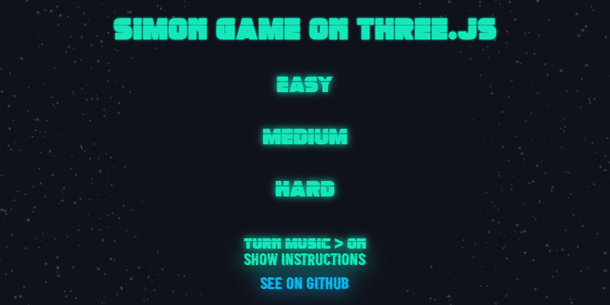
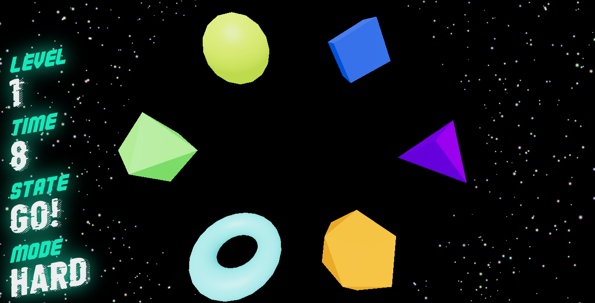

# Simon en Three.Js

Proyecto para la asigantura Sistemas y Tecnología Web: Cliente perteneciente almáster de Ingeniería Informática de la Universidad de La Laguna.

## Descripción

El proyecto se basa en el juego "Simón", cuyo objetivo es reproducir correctamente una secuencia mostrada previamente a fin de reforzar el desarrollo visual y la memoria en niños. Dicha reprodcución se llevará a cabo mediante la biblioteca Three.js, empleando figuras en 3D para mostrar las secuencias.

El juego consta de tres modos de dificultad donde el número de figuras, la longitud de las secuencias y el tiempo disponible varían:
- Nivel fácil.
    - Nº de objetos: 4.
    - Longitud de la secuencia en la ronda 1: 4.
    - Tiempo durante el que se iluminan/cambian de color cada objeto: 3
segundos.
    - Tiempo que tiene para resolver el juego: 3 * figuras en la secuencia.
- Nivel medio.
    - Nº de objetos: 5.
    - Longitud de la secuencia en la ronda 1: 5.
    - Tiempo durante el que se iluminan/cambian de color cada objeto: 2
segundos.
    - Tiempo que tiene para resolver el juego: 2 * figuras en la secuencia.
- Nivel difícil.
    - Nº de objetos: 6.
    - Longitud de la secuencia en la ronda 1: 6.
    - Tiempo durante el que se iluminan/cambian de color cada objeto: 1
segundos.
    - Tiempo que tiene para resolver el juego: 1.5 * figuras en la secuencia.

## Instalación y ejecución

Para ejecutar el proyecto en local, debe primero descargarse este repositorios, seguidamente instalar las depencias y luego ejecutar la tarea pertienente que elo ejecuta.

```sh
git clone https://github.com/alu0100898293/SYTWC-2122-ThreeJs.git
npm install -force
npm start
```
La instrucción de instalación precia del flag _-force_, debido a que se utilizan las versiones aún en prueba de React, lo cual provoca avisos de incompatibilidad.

## Despliegue online

El proyecto se encuentra desplegado en la plataforma Vercel y puede probar online en este [enlace](https://sytwc-2122-three-js.vercel.app/).

## Capturas






